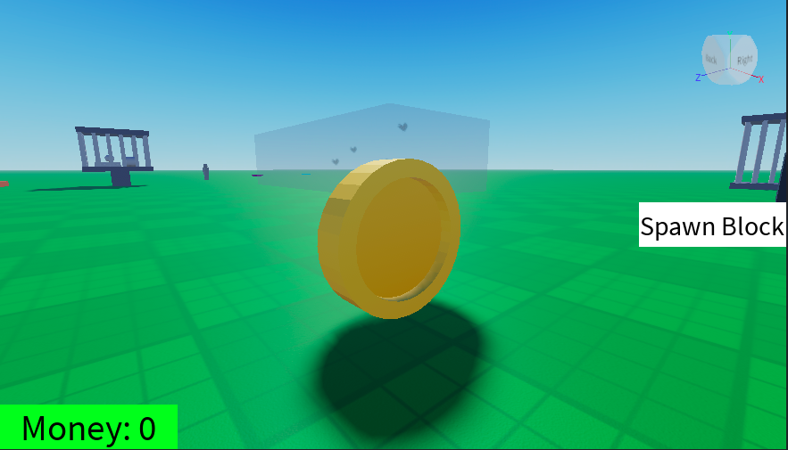
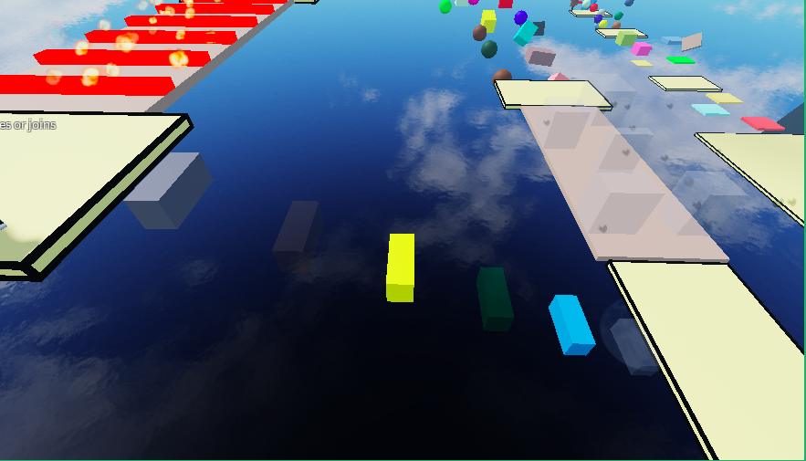
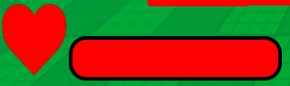
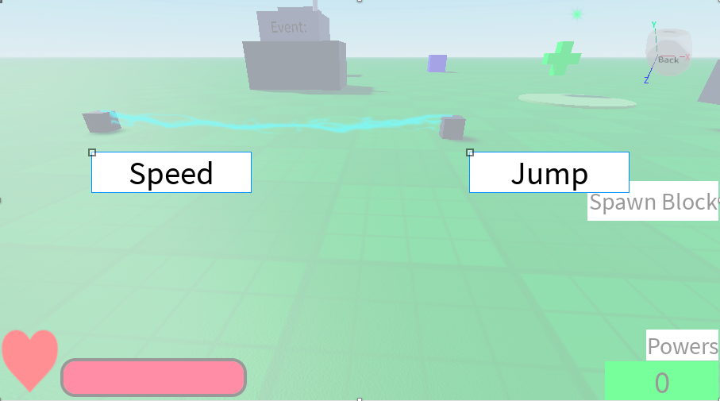
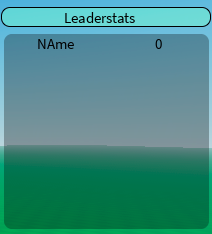
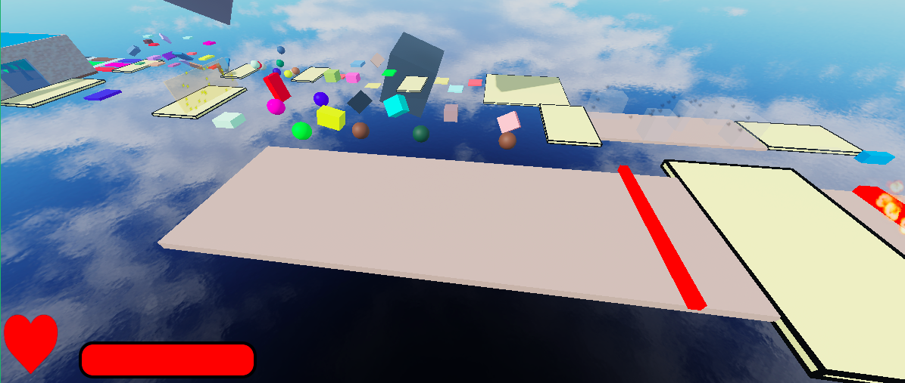

<h1 align="center">Hi 👋, I'm Aaron</h1>
<h3 align="center">My goal for making this account is to be in MIT and graduate with ComputerScience and Electrical Engineering PHD</h3>
<h3 align="center">Roblox dev(sort of beginner) • Luau and Python • Learning Game Systems & UI • Aspiring MIT CS & EE </h3>

- 🔭 I’m currently working on **A tycoon on Roblox**

- 🌱 I’m currently learning **Luau and Python**

<h3 align="left">Languages and Tools on this Repository:</h3>

  

# Mini Project 2026
## Day1: Hello, Killer Bricks, On Of Switch. 
**Date Completed:** Unknown  
**Purpose:** Make myself entertained  
**Key Concepts Learned:** Learned basic setup for a Roblox project and organizing objects.  

## Day2: Nothing Today  

## Day3 BlockSpawner  
**Date Completed:** March 2, 2026  
**Purpose:** To spawn blocks when UI is clicked  
**Key Concepts Learned:** Learned how to make buttons spawn blocks when clicked and show them in the right order.  
**Picture:**  

## Day4 MoleWacker  
**Date Completed:** March 3, 2026  
**Purpose:** To spawn a block is a specific area where you have to click it  
**Key Concepts Learned:** Learned how to spawn blocks randomly in a specific area and convert numbers to text.  
**Picture:**  

## Day5 Zap  
**Date Completed:** March 4, 2026  
**Purpose:** To damage the player and stop them after touched  
**Key Concepts Learned:** Learned how to damage a player when touched and use beam effects.  
**Picture:**  

## Day6 Power-ups  
**Date Completed:** March 5, 2026  
**Purpose:** To move players and control them and their velocity  
**Key Concepts Learned:** Learned to control player movement, including WalkSpeed, Jump, Health, and LinearVelocity.  
**Snippet:** local lv = Instance.new("LinearVelocity")  
		lv.Attachment0 = attachment  
		lv.VectorVelocity = velocity  
		lv.MaxForce = math.huge  
		lv.Parent = root  
**Picture:**  

## Day7 EventGenerator  
**Date Completed:** March 6, 2026  
**Purpose:** When clicked prompt gives you a random event  
**Key Concepts Learned:** Learned to make a button trigger random events and work with player characters.  
**Picture:**  

## Day8: Nothing Today  

## Day9 SpeedObby and WindObby  
**Date Completed:** March 8, 2026  
**Purpose:** SpeedObby: Get speed bost and jump long gaps  
         WindObby: Go down and dodge wind that puch you off  
**Key Concepts Learned:** Learned to make obstacle courses (SpeedObby and WindObby) and handle player movement and hazards.  
**Picture:**  
<table>
  <tr>
    <td></td>
    <td></td>
  </tr>
</table>

## Day10 TeleportMachine  
**Date Completed:** March 9, 2026  
**Purpose:** You touch one part and TP you to other part  
**Key Concepts Learned:** Learned to teleport players when touching a part and stop their movement safely.  
**Snippet:** "local hum = part.Parent:FindFirstChild("HumanoidRootPart") return hum"  
**Picture:**  

## Day11 CoinTracker  
**Date Completed:** March 10, 2026  
**Purpose:** When you get coins it updates your coin UI  
**Key Concepts Learned:** Learned to track coins, update UI, and use the .Changed event.  
**Snippet:** "coins.Changed:Connect(function()"  

## Day12 ButtonGateOpener  
**Date Completed:** March 11, 2026  
**Purpose:** When touch the button the gate opens  
**Key Concepts Learned:** Learned to open a gate when a button is touched.  
**Picture:**  

## Day13 CoinsGambler  
**Date Completed:** March 12, 2026  
**Purpose:** When click button gives you a 1 in 5 chances of getting 10 coins  
**Key Concepts Learned:** Learned to use random chance to give rewards and improve randomness logic.  
**Picture:**  

## Day14: Reflection  

## Day15 Leaderboard  
**Date Completed:** March 14, 2026  
**Purpose:** Shows player the leaderboard  
**Key Concepts Learned:** Learned to create a leaderboard that shows all players.  

## Day16 Coins  
**Date Completed:** March 15, 2026  
**Purpose:** When touches gives player extra coins  
**Key Concepts Learned:** Learned to give coins to players and update their personal leaderboard.  
**Picture:**  

## Day17 DisapearBlocks  
**Date Completed:** March 16, 2026  
**Purpose:** Every 1.5 seconds half the blocks disapear  
**Key Concepts Learned:** Learned to make blocks disappear over time using loops.  
**Picture:**  

## Day18 HealthBar  
**Date Completed:** March 17, 2026  
**Purpose:** Making a new health bar  
**Key Concepts Learned:** Learned to create a custom health bar and update it when player health changes.  
**Picture:**  

## Day19 MY BIRTHDAY WHOOOOOOOOOO!!!!!  

## Day20 HealthBar  
**Date Completed:** March 19, 2026  
**Purpose:** Uses tween service to put platform when lever is used  
**Key Concepts Learned:** Learned to use TweenService to move objects with a lever.  
**Picture:**  

## Day21 PowerChoser  
**Date Completed:** March 20, 2026  
**Purpose:** Gives you 2 options of powers to give you power  
**Key Concepts Learned:** Learned to give players choices for powers using UI and Tween effects.  
**Picture:**  

## Day22 Reflection  

## Day23 CustomLeaderstats  
**Date Completed:** March 22, 2026  
**Purpose:** Makes a leaderboard for the server with money  
**Key Concepts Learned:** Learned to make a custom server leaderboard for money and organize UI elements.  
**Picture:**  

## Day24 MovingLazer  
**Date Completed:** March 23, 2026  
**Purpose:** A kill brick that moves from left to right  
**Key Concepts Learned:** Learned to make a moving kill brick for players to avoid.  
**Picture:**  

## Day25: Nothing Today  

## Day26 Sol'sLikeRNG  
**Date Completed:** March 25, 2026  
**Purpose:** When clicks the button gives a cool animation  
**Key Concepts Learned:** Learned to trigger animations with buttons and use tweens and anchor points.  

## Day28 BetterUI  
**Date Completed:** March 26, 2026  
**Purpose:** To make UI scripts better and also the style  
**Key Concepts Learned:** Learned how to improved UI design with cleaner and organised scripts.  

## Day29: Weekly Review  

## Day30: Polishing  

## Day31: Big Reflection  

## Day32: Resting  

## Day33 EvenMorePolishing  

## Day28 UIShop  
**Date Completed:** April 1, 2026  
**Purpose:** To make a shop that opens when talk to npc  
**Key Concepts Learned:** Learned  
