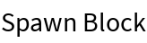
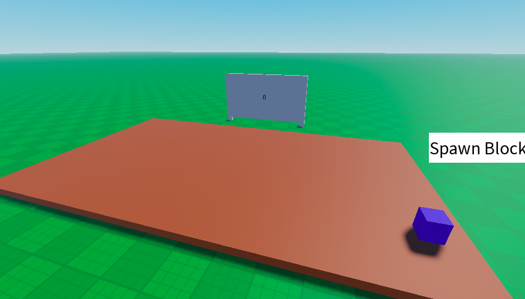
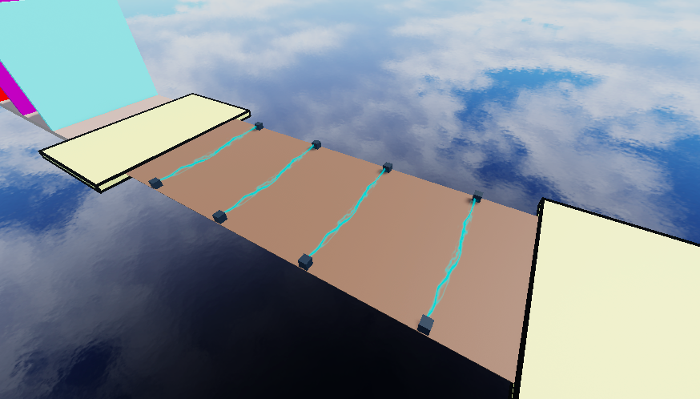
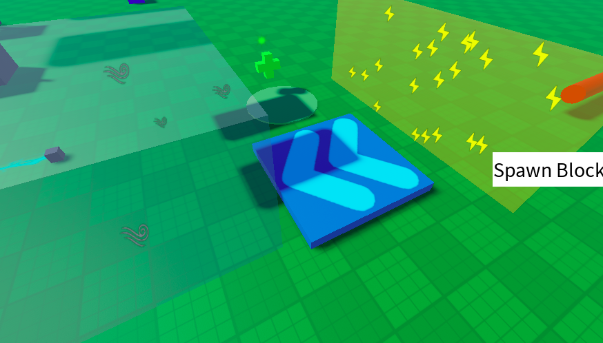
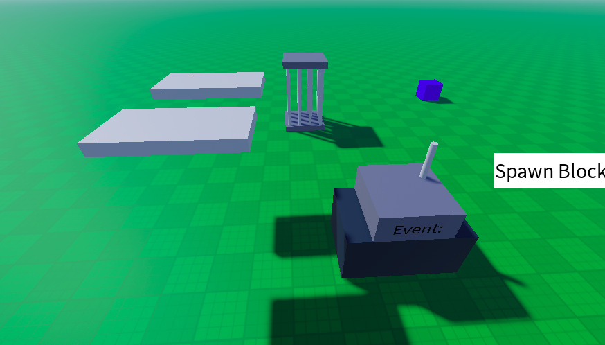
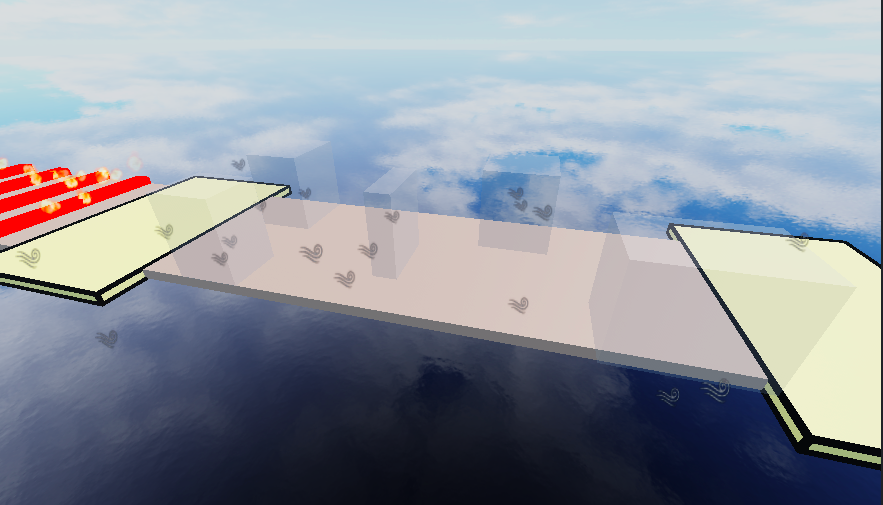
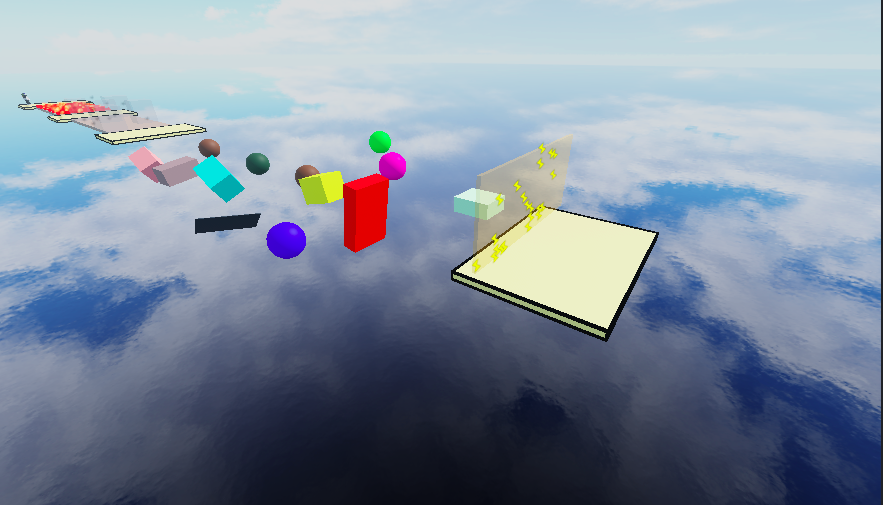
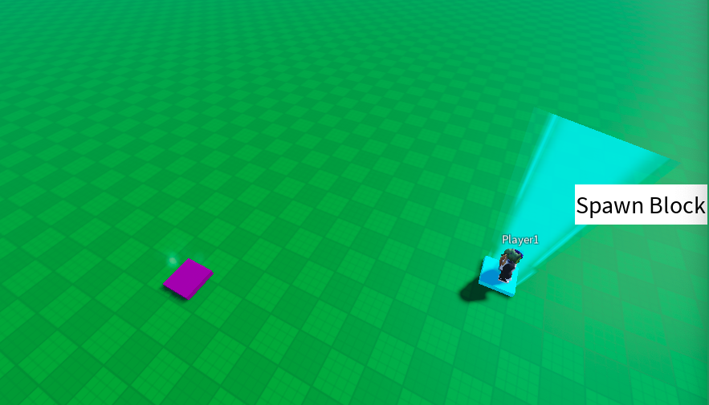
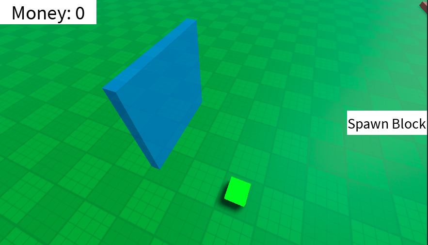
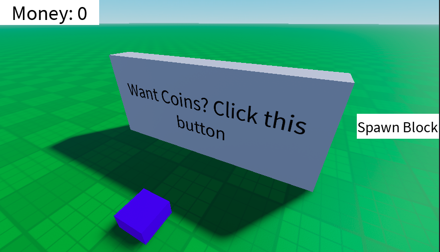

<h1 align="center">Hi 👋, I'm Aaron</h1>
<h3 align="center">My goal for making this account is to be in MIT and graduate with ComputerScience and Electrical Engineering PHD</h3>

- 🔭 I’m currently working on **A tycoon on Roblox**

- 🌱 I’m currently learning **Luau and Python**

<h3 align="left">Languages and Tools on this Repository:</h3>

  

# Mini Project 2026
## Day1: Hello, Killer Bricks, On Of Switch. 
Date Completed: Unknown  
Purpose: Make myself entertained  
Key Concepts Learned: Nothing  

## Day2: Nothing Today  

## Day3 BlockSpawner  
Date Completed: March 2, 2026  
Purpose: To spawn blocks when UI is clicked  
Key Concepts Learned: Clicked Event, ReplicatedEvents and DisplayOrder  
Pic:  

## Day4 MoleWacker  
Date Completed: March 3, 2026  
Purpose: To spawn a block is a specific area where you have to click it  
Key Concepts Learned: Random spawning, toString and spawning in a specific area  
Pic:  

## Day5 Zap  
Date Completed: March 4, 2026  
Purpose: To damage the player and stop them after touched  
Key Concepts Learned: Player Walkspeed and Beam  
Pic:  

## Day6 Power-ups  
Date Completed: March 5, 2026  
Purpose: To move players and control them and their velocity  
Key Concepts Learned: Walkspeed, Health, Jump, LinearVelocity  
Snippet: local lv = Instance.new("LinearVelocity")  
		lv.Attachment0 = attachment  
		lv.VectorVelocity = velocity  
		lv.MaxForce = math.huge  
		lv.Parent = root  
Pic:  

## Day7 EventGenerator  
Date Completed: March 6, 2026  
Purpose: When clicked prompt gives you a random event  
Key Concepts Learned: Humanoid root, table pairs and ipairs  
Pic:  

## Day8: Nothing Today  

## Day9 SpeedObby and WindObby  
Date Completed: March 8, 2026  
Purpose: SpeedObby: Get speed bost and jump long gaps  
         WindObby: Go down and dodge wind that puch you off  
Key Concepts Learned: Humanoid root, table pairs and ipairs  
Pic:  
<table>
  <tr>
    <td></td>
    <td></td>
  </tr>
</table>

## Day10 TeleportMachine  
Date Completed: March 9, 2026  
Purpose: You touch one part and TP you to other part  
Key Concepts Learned: HumanChecker, TouchDetector and StopPlayerMovement  
Snippet: "local hum = part.Parent:FindFirstChild("HumanoidRootPart") return hum"  
Pic:  

## Day11 CoinTracker  
Date Completed: March 10, 2026  
Purpose: When you get coins it updates your coin UI  
Key Concepts Learned: Change and leaderstats  
Snippet: "coins.Changed:Connect(function()"  

## Day12 ButtonGateOpener  
Date Completed: March 11, 2026  
Purpose: When touch the button the gate opens  
Key Concepts Learned: Nothing  
Pic:  

## Day13 CoinsGambler  
Date Completed: March 12, 2026  
Purpose: When click button gives you a 1 in 5 chances of getting 10 coins  
Key Concepts Learned: Better version of randomness  
Pic:  

## Day14: Nothing Today  

## Day13 Leadorboard  
Date Completed: March 14, 2026  
Purpose: Shows player the leaderboard  
Key Concepts Learned: PlayerAdded  
